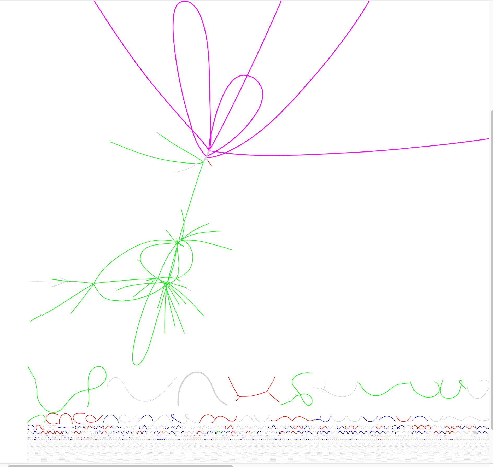

# Exploring assembly graphs

## Install bandage onto your VM

We are going to use Ryan Wick's excellent [Bandage](https://github.com/rrwick/Bandage) program to explore 
some assembly graphs from the infant gut data set. First install Bandage:

```
cd ~/repos
mkdir Bandage 
cd Bandage 
wget https://github.com/rrwick/Bandage/releases/download/v0.8.1/Bandage_Ubuntu_dynamic_v0_8_1.zip
unzip Bandage_Ubuntu_dynamic_v0_8_1.zip
cp Bandage ~/bin
```

## Now get two example example assembly graphs

We constructed two coassembly graphs from the first seven 1M subsampled infant gut samples.

```
cd Projects/InfantGut

mkdir AssemblyGraphs

wget https://desmantutorial.s3.climb.ac.uk/contigs_colorM.gfa
wget https://desmantutorials3.climb.ac.uk/high_res_colorM.gfa
```

Open up the first of these files contigs_colorM.gfa in Bandage. You should see something like this:



The colors correspond to four MAGs we obtained from clustering the Spades contigs: 
* Bin3 magenta, E. faecalis
* Bin7 blue 
* Bin12 red
* Bin19 green, Staph. epidermidis

