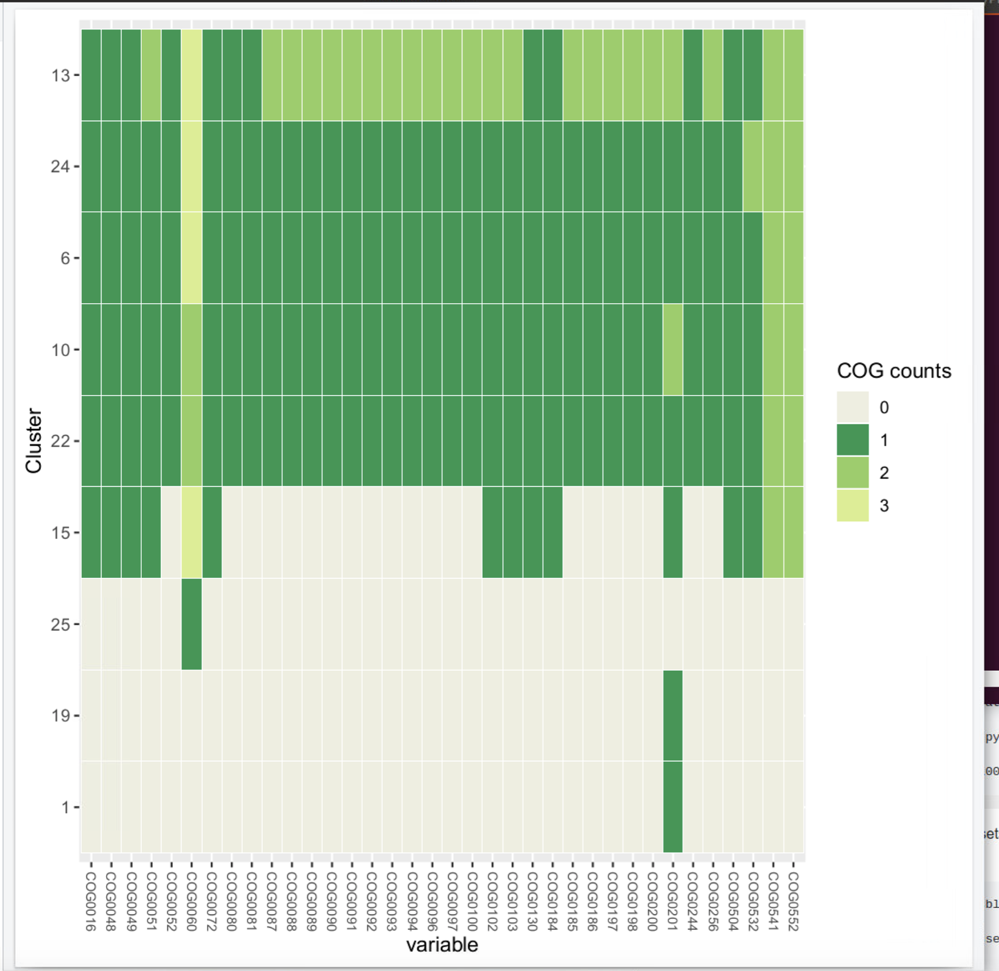
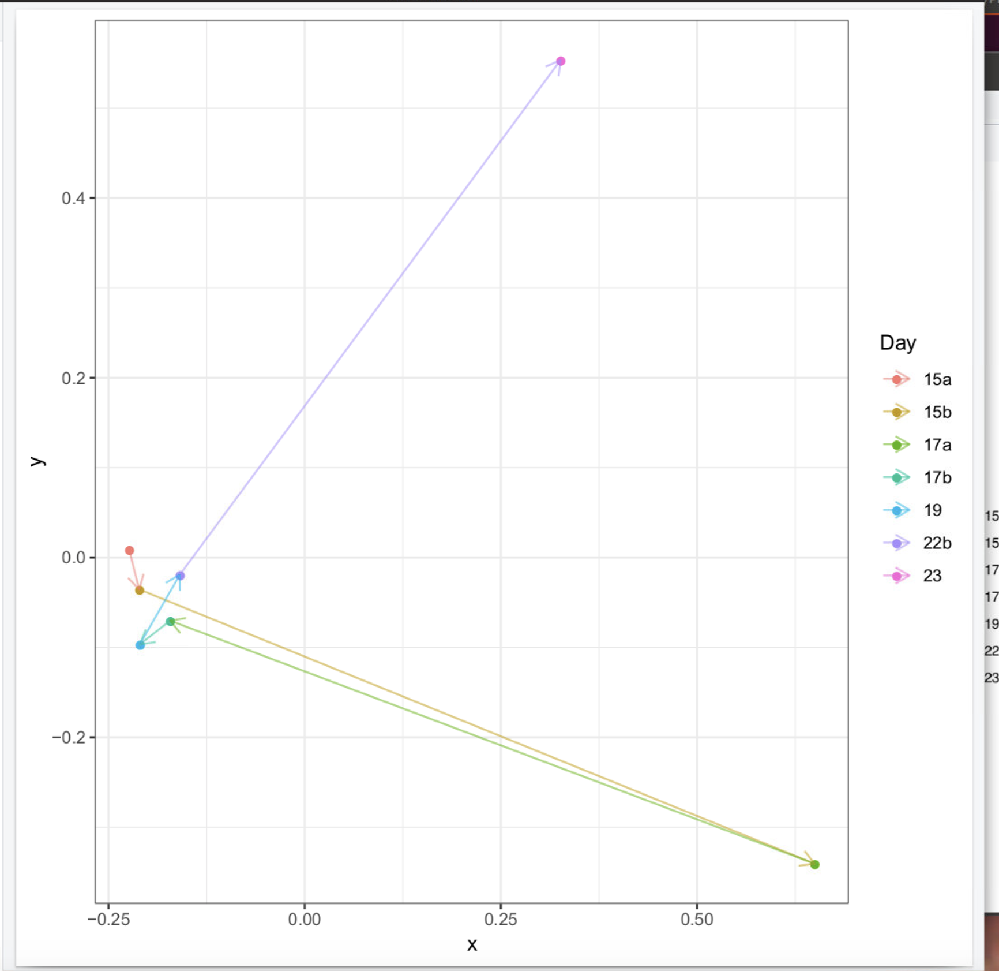
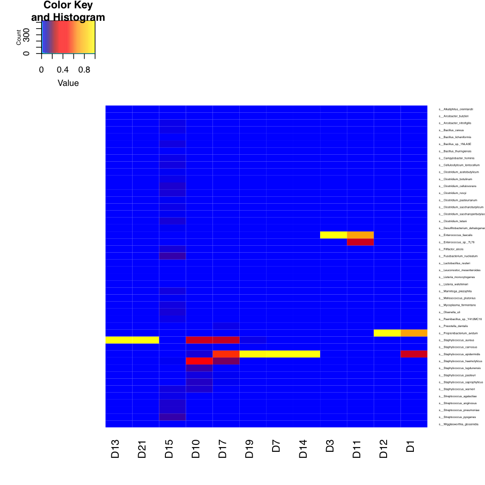

<a name="assembly"/>

# Assembly based metagenomics analysis

Assembly based metagenomics represents a complex analysis pathway:


1. [Coassembly](#coassembly)

2. [Read mapping](#readmapping)

3. [Contig binning](#binning)

4. [MAG annotation](#MAGs)

Login into your VM

We are now going to perform a basic assembly based metagenomics analysis of these same samples. 
This will involve a collection of different software programs:

1. megahit: A highly efficient metagenomics assembler currently our default for most studies

2. bwa: Necessary for mapping reads onto contigs

3. [samtools] (http://www.htslib.org/download/): Utilities for processing mapped files

4. CONCOCT: Our own contig binning algorithm

5. [prodigal] (https://github.com/hyattpd/prodigal/releases/): Used for calling genes on contigs

6. [gnu parallel] (http://www.gnu.org/software/parallel/): Used for parallelising rps-blast

7. [standalone blast] (http://www.ncbi.nlm.nih.gov/books/NBK52640/): Needs rps-blast

8. [COG RPS database] (ftp://ftp.ncbi.nih.gov/pub/mmdb/cdd/little_endian/): Cog databases

9. [GFF python parser] (https://github.com/chapmanb/bcbb/tree/master/gff)

<a name="coassembly"/>

Can clone off talk and tutorials:
```
cd repos
git clone https://github.com/chrisquince/EBITutorial.git 
```

## Assembly

Start off by creating a new working directory and linking in the infant gut samples:
```
mkdir Projects
cd Projects
mkdir InfantGut
cd InfantGut/
```

Copy off shared drive hopefully not too slow:
```
cp /media/penelopeprime/Metagenomics_Bioinformatics_Jun19/Day_3/3_Chris\ Quince/ReadsSub.tar.gz .
```

Then untar:
```
tar -xvzf ReadsSub.tar.gz
```

These are 1 million subsampled reads from the classic [Sharon et al. 2011 paper](https://www.ncbi.nlm.nih.gov/pmc/articles/PMC3530670/).


First let's try assembling a single sample with default parameters:
```
megahit -1 ReadsSub/sample1_R1.fastq -2 ReadsSub/sample1_R2.fastq -o Assembly1
```

Then evaluate:

```
~/repos/EBITutorial/scripts/contig-stats.pl < Assembly1/final.contigs.fa
```


## Co-assembly

We will now perform a co-assembly of all these samples using 
megahit:

```
cd ~/Projets/InfantGut
ls ReadsSub/*R1.fastq | tr "\n" "," | sed 's/,$//' > R1.csv
ls ReadsSub/*R2.fastq | tr "\n" "," | sed 's/,$//' > R2.csv
```

```
megahit -1 $(<R1.csv) -2 $(<R2.csv) -t 12 -o Assembly 
```

```
contig-stats.pl < Assembly/final.contigs.fa
```

Should see results like:
```
sequence #: 9920	total length: 16683496	max length: 628146	N50: 8525	N90: 447
```

Discussion point what is N50?

<a name="readmapping"/>

## Read mapping

Then cut up contigs and place in new dir:

```bash
export CONCOCT=~/repos/CONCOCT
python $CONCOCT/scripts/cut_up_fasta.py -c 10000 -o 0 -m Assembly/final.contigs.fa > Assembly/final_contigs_c10K.fa
```

Having cut-up the contigs the next step is to map all the reads from each sample back onto them. First index the contigs with bwa:

```bash
cd Assembly
bwa index final_contigs_c10K.fa
cd ..
```

Then perform the actual mapping you may want to put this in a shell script:

```bash
mkdir Map

for file in ./ReadsSub/*R1.fastq
do 
   
   stub=${file%_R1.fastq}
   name=${stub##*/}
   
   echo $stub

   file2=${stub}_R2.fastq

   bwa mem -t 12 Assembly/final_contigs_c10K.fa $file $file2 > Map/${name}.sam
done
```

And calculate coverages:

```
export DESMAN=~/repos/DESMAN
python $DESMAN/scripts/Lengths.py -i Assembly/final_contigs_c10K.fa > Assembly/Lengths.txt

for file in Map/*.sam
do
    stub=${file%.sam}
    stub2=${stub#Map\/}
    echo $stub  
    (samtools view -h -b -S $file > ${stub}.bam;samtools view -b -F 4 ${stub}.bam > ${stub}.mapped.bam;samtools sort -m 1000000000 ${stub}.mapped.bam -o ${stub}.mapped.sorted.bam; bedtools genomecov -ibam ${stub}.mapped.sorted.bam -g Assembly/Lengths.txt > ${stub}_cov.txt)&
done
```
Collate coverages together:

```
for i in Map/*_cov.txt 
do 
   echo $i
   stub=${i%_cov.txt}
   stub=${stub#Map\/}
   echo $stub
   awk -F"\t" '{l[$1]=l[$1]+($2 *$3);r[$1]=$4} END {for (i in l){print i","(l[i]/r[i])}}' $i > Map/${stub}_cov.csv
done

$DESMAN/scripts/Collate.pl Map > Coverage.csv
```

<a name="binning"/>

## Contig binning

Now we can run CONCOCT:
```

    mkdir Concoct

    mv Coverage.csv Concoct

    cd Concoct

    tr "," "\t" < Coverage.csv > Coverage.tsv

    concoct --coverage_file Coverage.tsv --composition_file ../Assembly/final_contigs_c10K.fa -t 12 

```

## Getting single copy core genes

Find genes using prodigal:
```
    mkdir ~/Projects/InfantGut/Annotate
    cd ~/Projects/InfantGut/Annotate
    
    $DESMAN/scripts/LengthFilter.py ../Assembly/final_contigs_c10K.fa -m 1000 > final_contigs_gt1000_c10K.fa

    prodigal -i final_contigs_gt1000_c10K.fa -a final_contigs_gt1000_c10K.faa -d final_contigs_gt1000_c10K.fna  -f gff -p meta -o final_contigs_gt1000_c10K.gff 
```

Assign COGs:
```
    export COGSDB=~/Databases/rpsblast_cog_db/Cog
   
    rpsblast+ -outfmt '6 qseqid sseqid evalue pident score qstart qend sstart send length slen' -evalue 0.00001 -query final_contigs_gt1000_c10K.faa -db $COGSDB -out final_contigs_gt1000_c10K_rps.tsv
   
```

We are also going to refine the output using single-core gene frequencies. First we calculate scg frequencies on the CONCOCT clusters:
```
cd ../Concoct
python $CONCOCT/scripts/COG_table.py -b ../Annotate/final_contigs_gt1000_c10K_rps.tsv  -m $CONCOCT/scgs/scg_cogs_min0.97_max1.03_unique_genera.txt -c clustering_gt1000R.csv  --cdd_cog_file $CONCOCT/scgs/cdd_to_cog.tsv > clustering_gt1000_scg.tsv
```

This should result in 4 clusters with 75% single copy copy SCGs:


<a name="MAGs"/>

## Metagenome assembled genomes (MAGs)

First let us look at the cluster completeness:
```
$CONCOCT/scripts/COGPlot.R -s clustering_gt1000_scg.tsv -o clustering_gt1000_scg.pdf
evince clustering_gt1000_scg.pdf
```

 

Discussion point what is a MAG?

Then we calculate coverage of each cluster/MAG in each sample.
```
sed '1d' clustering_gt1000.csv > clustering_gt1000R.csv
python $DESMAN/scripts/ClusterMeanCov.py Coverage.csv clustering_gt1000R.csv ../Assembly/final_contigs_c10K.fa > clustering_gt1000_cov.csv
sed 's/Map\///g' clustering_gt1000_cov.csv > clustering_gt1000_covR.csv
```

Discussion point, how do we calculate cluster coverages?

```
cp ~/repos/EBITutorial/scripts/ClusterCovNMDS.R .
cp ~/repos/EBITutorial/Meta.csv .
Rscript ./ClusterCovNMDS.R
```

How well does this correlate with time/replicates.

 


## Annotate MAGs

First lets label COGs on genes:
```
cd ~/Projects/InfantGut/Annotate
python $DESMAN/scripts/ExtractCogs.py -b final_contigs_gt1000_c10K_rps.tsv --cdd_cog_file $CONCOCT/scgs/cdd_to_cog.tsv -g final_contigs_gt1000_c10K.gff > final_contigs_gt1000_c10K.cogs
```

Discussion point what is a COG?


## Taxonomic Classification of Contigs

```
cd ~/Projects/InfantGut/
~/bin/kraken2 --db ~/Databases/minikraken_20171013_4GB --threads 8 final_contigs_gt1000_c10K.fa > final_contigs_gt1000_c10K.krak 
Loading database... complete.
```

```
kraken-report --db ~/CONCOCT_Data/minikraken_20171013_4GB final_contigs_gt1000_c10K.krak 
```

```
kraken-translate --mpa-format --db ~/CONCOCT_Data/minikraken_20171013_4GB final_contigs_gt1000_c10K.krak > final_contigs_gt1000_c10K.krak.mpi.tran
```

```
cut -f2 final_contigs_gt1000_c10K.krak.mpi.tran | cut -d"|" -f7 > SpeciesAss.txt
cut -f1 final_contigs_gt1000_c10K.krak.mpi.tran > Ids.txt
paste Ids.txt SpeciesAss.txt | grep "s__" | tr "\t" "," > Contig_Species.csv
```


These can then be used for a cluster confusion plot:
```
$CONCOCT/scripts/Validate.pl --cfile=../Concoct/clustering_refine.csv --sfile=Contig_pecies.csv --ffile=../Assembly/final_contigs_c10K.fa --ofile=Taxa_Conf.csv
```
Now the results will be somewhat different...
```
N	M	TL	S	K	Rec.	Prec.	NMI	Rand	AdjRand
2356	1720	1.0855e+07	46	22	0.958779	0.939837	0.883243	0.979203	0.939598
```

Then plot:
```
$CONCOCT/scripts/ConfPlot.R -c Taxa_Conf.csv -o Taxa_Conf.pdf
```




Return to the analysis directory and create a new directory to bin the contigs into:

```
mkdir Split
cd Split
$DESMAN/scripts/SplitClusters.pl ../Annotate/final_contigs_gt1000_c10K.fa ../Concoct/clustering_gt1000.csv
SplitCOGs.pl ../Annotate/final_contigs_gt1000_c10K.cogs ../Concoct/clustering_gt1000.csv
SplitGenes.pl ../Annotate/final_contigs_gt1000_c10K.genes ../Concoct/clustering_gt1000.csv
SplitFaa.pl ../Annotate/final_contigs_gt1000_c10K.faa ../Concoct/clustering_gt1000.csv
```


