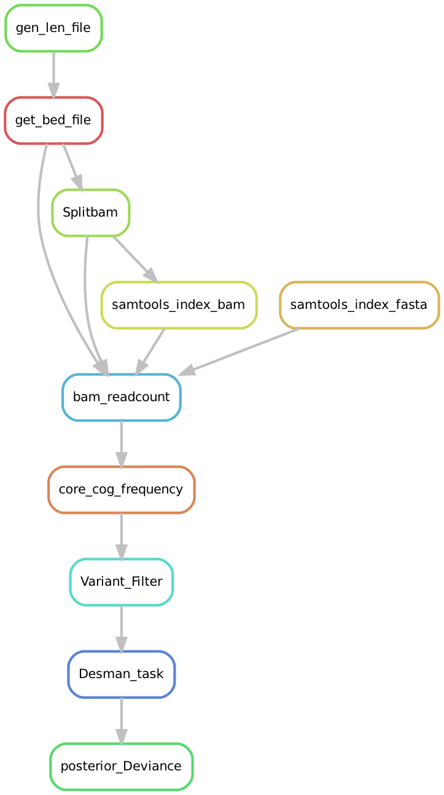
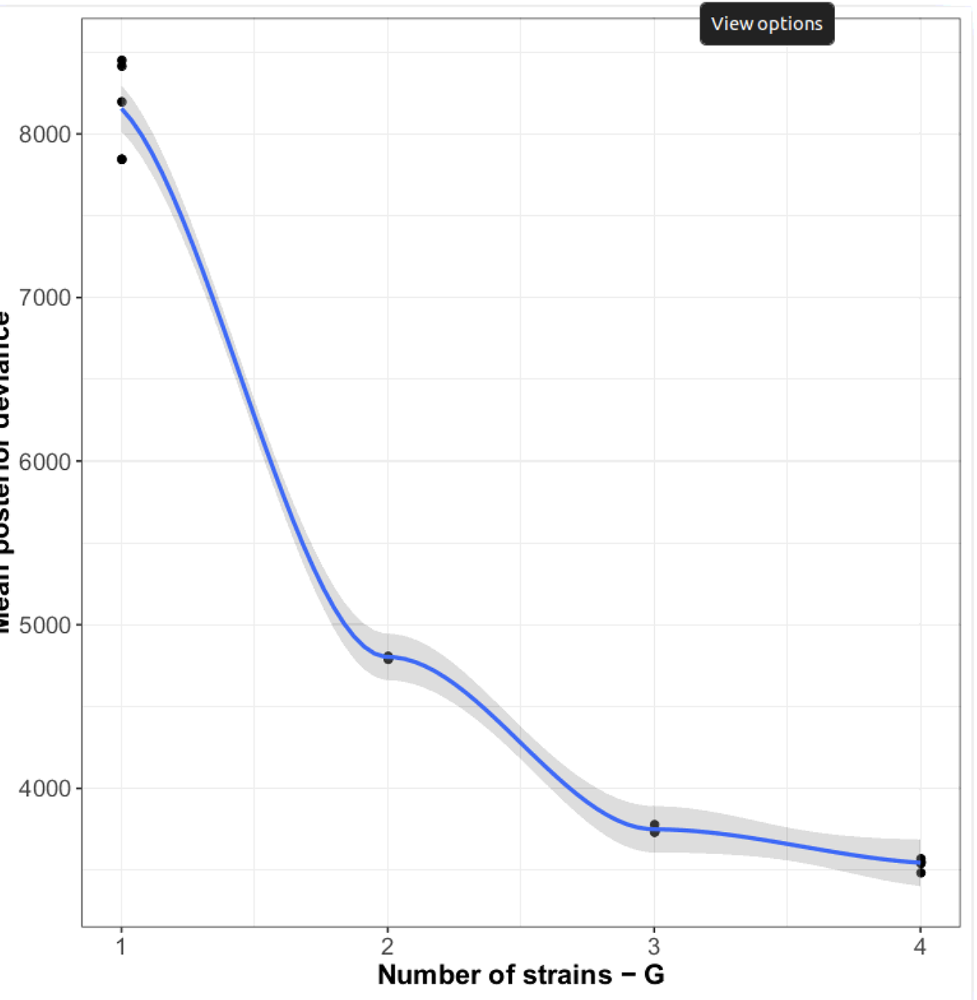
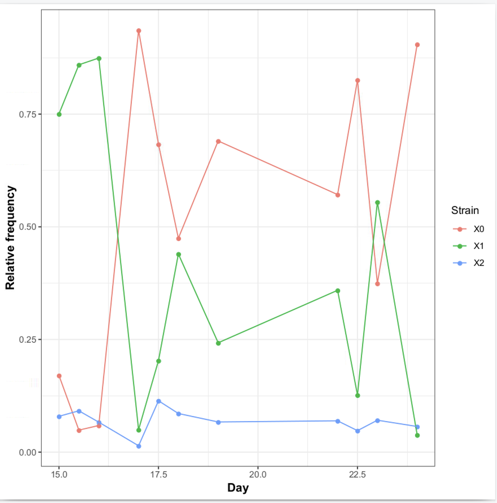


# Strain Resolution

## Run the DESMAN pipeline to resolve strains in each high quality bin


Start by copying prerun data set. This was generated by the binning tutorial (do not run). [Binning!](https://https://github.com/chrisquince/EBITutorial/blob/master/Binning.md)

```
mkdir Projects
cd ~/Projects
cp /media/penelopeprime/Metagenomics_Bioinformatics_Jun19/Day_3/3_Chris\ Quince/InfantGut.tar.gz .
tar -xvzf InfantGut.tar.gz
```
Then update EBITutorial repo. This is ***very*** important:
```
cd ~/repos/EBITutorial
git pull
```

### Getting core variant frequencies

We will run DESMAN on two complete clusters with more than 50fold coverage. Find these with the following simple script:
```
cd InfantGut
python3 ~/repos/EBITutorial/scripts/CompleteClustersCov.py Concoct/clustering_gt1000_scg.tsv Concoct/clustering_gt1000_covR.csv 
```

Cluster10 is Staph. epidermidis and Cluster6 E. faecalis, how would we of determined that?

Starting from here, we're going to use snakemake to generate files. Snakemake is a python based workflow management tool. It formalise a collections 
of scripts as rules possessing input and output. It is able to derive from the files you want to generate, the succession of scripts (rules) needed. 
Obviously if it cannot find any file from which to build on with your scripts, it will crash. Begin by copying the snakemake rules into your Project directory:
```
cd ~/Projects/InfantGut
cp ~/repos/EBITutorial/Desman.snake .

```

Lets draw the complete workflow for Cluster10 as a graph using snakemake and graphviz
```
 
    sudo apt install graphviz # we need to install graphviz to draw this graph 

    # we specify the end results to be able to see the succesion of task needed to generate it
    snakemake --snakefile Desman.snake --cores 10 --rulegraph SCG_Analysis/Cluster10/Dev.csv > workflow.dot 
    dot -Tpdf workflow.dot -o workflow.pdf 
    evince  workflow.pdf 
```



Another very useful flag is ***--dryrun*** this lists the jobs that would be run by snakemake if you did run it.
```
snakemake --snakefile Desman.snake --cores 10 SCG_Analysis/Cluster10/Dev.csv --dryrun --verbose
```

Can you get the jobs that would be run for Cluster6?

We will not run the complete pipeline. We have added a checkpoint after the bam files are split and bases on each contig position are 
counted. We will run until this point:
```
snakemake --snakefile Desman.snake --cores 10 SplitBam/readcount_is_done  
```

Take a look at the output files...

Now we will continue the pre-processing to get the base frequencies on the core genes for both clusters:

```
snakemake --snakefile Desman.snake --cores 10 Variants/Cluster10_scg.freq Variants/Cluster6_scg.freq --dryrun --verbose
```

***Now run it for real*** This will take 15-20 mins so we will take a short break.


The directory contains 2 .freq files one for each cluster. If we look at one:
```bash
head -n 10 Variants/Cluster10_scg.freq 
```
We see it comprises a header, plus one line for each core gene position, giving base frequencies in the order A,C,G,T. This is the input required by DESMAN.

### Detecting variants on core genes

First we detect variants on both clusters that were identified as 75% pure and complete and had a coverage of greater than 100.

```bash

mkdir -p SCG_Analysis/Cluster10

Variant_Filter.py ./Variants/Cluster10/Cluster10_scg.freq -o ./SCG_Analysis/Cluster10/Cluster10_scg -p -m 1.0

```

Now automatically run both:
```bash
cd ~/Projects/InfantGut/
snakemake --snakefile Desman.snake --cores 10 SCG_Analysis/Cluster10_scgsel_var.csv SCG_Analysis/Cluster6/Cluster6_scgsel_var.csv 
```


The Variant_Filter.py script produces an output file Cluster10_sel_var.csv which lists those positions that are identified as variants by the log-ratio test with FDR < 1.0e-3. We can compare variant frequencies in the two clusters:

```bash
cd SCG_Analysis
wc */*sel_var.csv
```

Which MAG has more variation?

We can also go into the Cluster 10 directory and look at the output files:
```bash
cd Cluster10
more Cluster10_scgsel_var.csv 
```

The other important file is:
```bash
more Cluster10_scgtran_df.csv
```

This is an estimate of base error rates which is used as a starting point for the haplotype inference.


### Inferring haplotypes with Desman

So accounting for the header line we observe 134 and 16 variants in Clusters 10 and 6 respectively. 
For Cluster 10 then can we attempt to resolve haplotypes. First we will run the desman program once for a single 
number of haplotypes as an illustration:

```
cd ~/Projects/InfantGut/SCG_Analysis/Cluster10

desman Cluster10_scgsel_var.csv -e Cluster10_scgtran_df.csv -o test3 -g 3 -s 21718 -m 1.0 -i 100
```

Tidy that up:
```
rm -r test3
```

Now we will run with 1,..,5 haplotypes with 5 replicates each.
```
cd ~/Projects/InfantGut/
snakemake --snakefile Desman.snake --cores 10 SCG_Analysis/Cluster10/Dev.csv
```
The Dev.csv file is generated by calling desman multiple time, and calculating the estimated posterior deviance of the model with 1 to 4 strain over 5 repetitions.

Which we can then visualise:
```
Rscript $DESMAN/scripts/PlotDev.R -l SCG_Analysis/Cluster10/Dev.csv -o SCG_Analysis/Cluster10/Dev.pdf

evince SCG_Analysis/Cluster10/Dev.pdf
```



There are two or possibly three haplotypes. We can also run the heuristic to determine haplotype number:

```bash
python $DESMAN/scripts/resolvenhap.py SCG_Analysis/Cluster10/Cluster10
```

This should output:
```
3,3,0,0.03668261562998405,Cluster10_3_0/Filtered_Tau_star.csv
```

This has the format:
```
No of haplotypes in best fit, No. of good haplotypes in best fit, Index of best fit, Average error rate, File with base predictions
```

Have a look at the prediction file:
```
cd SCG_Analysis/Cluster10
more Cluster10_3_0/Filtered_Tau_star.csv
cd ../..
```

The position encoding is ACGT so what are the base predictions at each variant position? 
We can turn these into actual sequences with the following commands:

```bash

    cut -d"," -f 1 < Cluster10_scgsel_var.csv | sort | uniq | sed '1d' > coregenes.txt

    mkdir SCG_Fasta_3_0
    
    python $DESMAN/scripts/GetVariantsCore.py ../../Annotate/final_contigs_gt1000_c10K.fa ../..//Split/Cluster10/Cluster10_core.cogs Cluster10_3_0/Filtered_Tau_star.csv coregenes.txt -o SCG_Fasta_3_0/
```

This generates one fasta sequence file for each gene with the two strains in:

```bash
ls SCG_Fasta_3_0
```


```bash
python $DESMAN/scripts/validateSNP2.py Cluster10_3_0/Filtered_Tau_star.csv Cluster10_3_0/Filtered_Tau_star.csv
``` 


This gives distance matrices between the true variants and the predictions in terms of SNV and fractions:
```bash
Intersection: 209
[[  0  66 173]
 [ 66   0 180]
 [173 180   0]]
[[0.         0.31578947 0.8277512 ]
 [0.31578947 0.         0.86124402]
 [0.8277512  0.86124402 0.        ]]
```

Now look at time series of strain abundance:

```
cp $EBITutorial/scripts/TimeStrain.R .
cp $EBITutorial/MetaT.csv .
Rscript TimeStrain.R -g Cluster10_3_0/Gamma_starR.csv -m MetaT.csv
```



Now repeat the Desman analysis for ***Cluster6***...


Are any subpopulations found?


### Accessory Gene assignment

The next step would be to calculate the accessory gene presence and absences for these strains. 

```
cd ~/Projects/InfantGut/

mkdir AllFreq

```

Then we get frequencies but now for all genes:

```
python3 $DESMAN/scripts/ExtractCountFreqGenes.py -g Split/Cluster10/Cluster10.genes ./SplitBam/Cluster10/ReadcountFilter --output_file AllFreq/Cluster10.freq

```

and find variants on those genes:

```
cd AllFreq
Variant_Filter.py Cluster10.freq -o Cluster10 -m 1.0
```

How many variants do we find on the accessory genome?

We also need gene coverages these we compute from the frequencies:

```
python3 $DESMAN/scripts/CalcGeneCov.py Cluster10.freq > Cluster10_gene_cov.csv
```

```
cut -d"," -f5 ../Split/Cluster10/Cluster10_core.cogs > Cluster10_core_genes.txt
```

Calculate coverage on core genes:

```
python3 $DESMAN/scripts/CalcDelta.py Cluster10_gene_cov.csv Cluster10_core_genes.txt Cluster10_core
```

Now lets link the best run from DESMAN for convenience:

```
ln -s ../SCG_Analysis/Cluster10_scg/Cluster10_3_0 .
```

and finally:

```
python3 $DESMAN/desman/GeneAssign.py Cluster10_coremean_sd_df.csv Cluster10_3_0/Gamma_star.csv Cluster10_gene_cov.csv Cluster10_3_0/Eta_star.csv -m 20 -v Cluster10sel_var.csv -o Cluster10 --assign_tau
```

And look at gene and SNP divergence:
```
python ~/repos/EBITutorial/scripts/IdentEtaGamma.py Cluster10 Cluster10etaS_df.csv Cluster10_3_0/Selected_variants.csv Cluster10_3_0/Filtered_Tau_starR.csv Cluster10_3_0/Gamma_starR.csv
```

