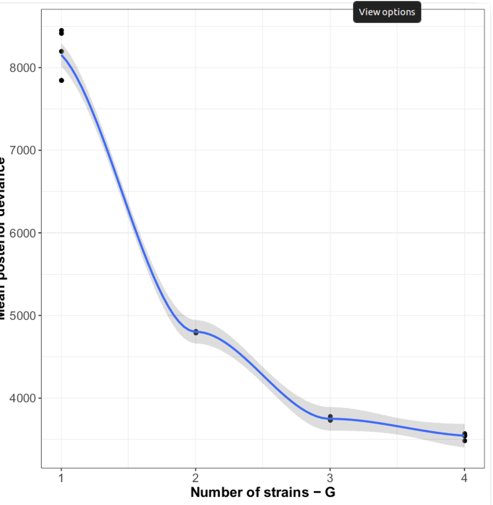

# Strain Resolution

## Run the DESMAN pipeline to resolve strains in each high quality bin

### What to do if CONCOCT analysis was not completed yesterday:

Connect with SSH to your VM

  2. Mount the volume with

  mount ~/nextcloud
  

Supplementary material - Installation of the DAVFS client
---------------------------------------------------------

1. First check if you can copy the template for the davfs2 secrets' file?
```bash
sudo cp  /etc/davfs2/secrets ~/.davfs2/secrets
```
N.B.1: You can also modify the file '~/.davfs2/secrets' with the EDAME parameters by adding this line at the end:

  https://10.158.16.80/remote.php/webdav/ myVolumeUsername myVolumePassword

If the template is also not present, follow the instructions below.

2. get the script to install the DAVFS client:
```bash
curl -O https://raw.githubusercontent.com/IFB-ElixirFr/biosphere-commons/master/scripts/utils/biosphere-nextcloud-client.sh
```

3. run it:

source ./biosphere-nextcloud-client.sh

If no error occurred, sign off the current SSH session, sign in again (to enable the right authorizations), and continue to next step.

4.   

```bash
mount ~/nextcloud
````

You will be asked for your username and password.
  
  !! Remember that your username for the volume is the left part of your email address. 
  If the mount is not working, check that the directory '~/nextcloud' and the file '~/.davfs2/secrets' exist. 
  Otherwise you certainly need to install again the DAVFS client, see below how to do this.

Then copy prerun data set:
```
cd ~/Projects
mv InfantGut InfantGut_bkup
cp ~/nextcloud/ebame-data/InfantGut.tar.gz .
tar -xvzf InfantGut.tar.gz
```

### Getting core variant frequencies

Then we select the SCGS for each cluster:
```bash
cd ~/Projects/InfantGut

cp ~/repos/MAGAnalysis/cogs.txt scgs.txt 
while read -r cluster 
do
    echo $cluster
    $DESMAN/scripts/SelectContigsPos.pl scgs.txt < Split/${cluster}/${cluster}.cog > Split/${cluster}/${cluster}_core.cogs
done < Split/Cluster75.txt
```

The first step in pre-processing for DESMAN would be to split up the bam files by each cluster in turn:

```
cd Annotate
python $DESMAN/scripts/Lengths.py -i final_contigs_gt1000_c10K.fa > final_contigs_gt1000_c10K.len
cd ..
```

We will run DESMAN on two complete clusters with more than 50fold coverage. Find these with the following simple script:
```
python3 ~/repos/Ebame4/scripts/CompleteClustersCov.py Concoct/clustering_gt1000_scg.tsv Concoct/clustering_gt1000_covR.csv > Split/Comp50.txt
```

What species are these clusters likely from?

The split mapping files:
```
mkdir SplitBam

while read -r cluster 
do
    grep ">" Split/${cluster}/${cluster}.fa | sed 's/>//g' > Split/${cluster}/${cluster}_contigs.txt
    AddLengths.pl Annotate/final_contigs_gt1000_c10K.len < Split/${cluster}/${cluster}_contigs.txt > Split/${cluster}/${cluster}_contigs.tsv
    mkdir SplitBam/${cluster}
    echo $cluster
    for bamfile in Map/*.mapped.sorted.bam
    do
        stub=${bamfile#Map\/}
        stub=${stub%.mapped.sorted.bam}
        echo $stub
        samtools view -bhL Split/${cluster}/${cluster}_contigs.tsv $bamfile > SplitBam/${cluster}/${stub}_Filter.bam&

    done 
        
done < Split/Comp50.txt 
```


and use a third party program bam-readcount to get base frequencies at each position on each contig:

```
while read line
do
    mag=$line

    echo $mag

    cd SplitBam
    cd ${mag}

    cp ../../Split/${mag}/${mag}_contigs.tsv ${mag}_contigs.tsv
    samtools faidx ../../Split/${mag}/${mag}.fa

    echo "${mag}_contigs.tsv"
    mkdir ReadcountFilter
    for bamfile in *_Filter.bam
    do
        stub=${bamfile%_Filter.bam}
            
        echo $stub

        (samtools index $bamfile; bam-readcount -w 1 -q 20 -l "${mag}_contigs.tsv" -f ../../Split/${mag}/${mag}.fa $bamfile 2> ReadcountFilter/${stub}.err > ReadcountFilter/${stub}.cnt)&
    
     done
     cd ..
     cd ..
     
done < Split/Comp50.txt

``` 


Then we can get the base counts on the core cogs:

```

mkdir Variants
while read -r cluster 
do
    echo $cluster
    (cd ./SplitBam/${cluster}/ReadcountFilter; gzip *cnt; cd ../../..; python $DESMAN/scripts/ExtractCountFreqGenes.py Split/${cluster}/${cluster}_core.cogs ./SplitBam/${cluster}/ReadcountFilter --output_file Variants/${cluster}_scg.freq > Variants/${cluster}log.txt)&

done < Split/Comp50.txt
``` 

The directory contains 2 .freq files one for each cluster. If we look at one:
```bash
head -n 10 Variants/Cluster9_scg.freq 
```
We see it comprises a header, plus one line for each core gene position, giving base frequencies in the order A,C,G,T. This is the input required by DESMAN.

### Detecting variants on core genes

First we detect variants on both clusters that were identified as 75% pure and complete and had a coverage of greater than 100:

```bash

cd ~/Projects/InfantGut/

mkdir SCG_Analysis

for file in ./Variants/*freq
do
    echo $file

    stub=${file%.freq}
    stub=${stub#./Variants\/}

    echo $stub

    mkdir SCG_Analysis/$stub
    
    cp $file SCG_Analysis/$stub
    cd SCG_Analysis/$stub    

    Variant_Filter.py ${stub}.freq -o $stub -p -m 1.0
    
    cd ../..
done

```

The Variant_Filter.py script produces an output file ${stub}sel_var.csv which lists those positions that are identified as variants by the log-ratio test with FDR < 1.0e-3. We can compare variant frequencies in the two clusters:

```bash
cd SCG_Analysis
wc */*sel_var.csv
```

We can also go into the Cluster 14 directory and look at the output files:
```bash
cd Cluster14_scg
more Cluster14_scgsel_var.csv 
```

The other important file is:
```bash
more Cluster14_scgtran_df.csv
```

This is an estimate of base error rates which is used as a starting point for the haplotype inference.


### Inferring haplotypes

So accounting for the header line we observe 185 and 10 variants in Clusters 14 and 9 respectively. 
For Cluster 14 then can we attempt to resolve haplotypes. Using the desman executable:

```
cd Cluster14_scg

varFile='Cluster14_scgsel_var.csv'

eFile='Cluster14_scgtran_df.csv'
    
for g in 1 2 3 4  
do
    echo $g
    for r in 0 1 2 3 4
    do
	    echo $r
        (desman $varFile -e $eFile -o Cluster14_${g}_${r} -g $g -s $r -m 1.0 -i 100)& 
    done
    wait
done
```

Now lets look at the posterior deviance:
```
cat */fit.txt | cut -d"," -f2- > Dev.csv
sed -i '1iH,G,LP,Dev' Dev.csv 
```

Which we can then visualise:
```
$DESMAN/scripts/PlotDev.R -l Dev.csv -o Dev.pdf
```



There are two or possibly three haplotypes. We can also run the heuristic to determine haplotype number:

```bash
python $DESMAN/scripts/resolvenhap.py Cluster14
```

This should output:
```
3,3,0,0.03668261562998405,Cluster14_3_0/Filtered_Tau_star.csv
```

This has the format:
```
No of haplotypes in best fit, No. of good haplotypes in best fit, Index of best fit, Average error rate, File with base predictions
```

Have a look at the prediction file:
```
more Cluster14_3_0/Filtered_Tau_star.csv
```

The position encoding is ACGT so what are the base predictions at each variant position? 
We can turn these into actual sequences with the following commands:

```bash

    cut -d"," -f 1 < Cluster14_scgsel_var.csv | sort | uniq | sed '1d' > coregenes.txt

    mkdir SCG_Fasta_3_0
    
    python $DESMAN/scripts/GetVariantsCore.py ../../Annotate/final_contigs_gt1000_c10K.fa ../..//Split/Cluster14/Cluster14_core.cogs Cluster14_3_0/Filtered_Tau_star.csv coregenes.txt -o SCG_Fasta_3_0/
```

This generates one fasta sequence file for each gene with the two strains in:

```bash
ls SCG_Fasta_3_0
```


```bash
python $DESMAN/scripts/validateSNP2.py Cluster14_3_0/Filtered_Tau_star.csv Cluster14_3_0/Filtered_Tau_star.csv
``` 


This gives distance matrices between the true variants and the predictions in terms of SNV and fractions:
```bash
Intersection: 209
[[  0  66 173]
 [ 66   0 180]
 [173 180   0]]
[[0.         0.31578947 0.8277512 ]
 [0.31578947 0.         0.86124402]
 [0.8277512  0.86124402 0.        ]]
```

Now look at time series of strain abundance:

```
cp ~/repos/Ebame4/scripts/TimeStrain.R .
Rscript TimeStrain.R -g Cluster14_3_0/Gamma_starR.csv -m ~/Projects/InfantGut/Meta.csv
```


Then for Cluster9
```

cd ~/Projects/InfantGut/SCG_Analysis/Cluster9_scg

varFile='Cluster9_scgsel_var.csv'

eFile='Cluster9_scgtran_df.csv'
    
for g in 1 2 3 4  
do
    echo $g
    for r in 0 1 2 3 4
    do
	    echo $r
        (desman $varFile -e $eFile -o Cluster9_${g}_${r} -g $g -s $r -m 1.0 -i 100)& 
    done
    wait
done
```

Are any subpopulations found?


### Accessory Gene assignment

The next step would be to calculate the accessory gene presence and absences for these strains. 

```
cd ~/Projects/InfantGut/

mkdir AllFreq

```

Then we get frequencies but now for all genes:

```
python3 $DESMAN/scripts/ExtractCountFreqGenes.py -g Split/Cluster14/Cluster14.genes ./SplitBam/Cluster14/ReadcountFilter --output_file AllFreq/Cluster14.freq

```

and find variants on those genes:

```
cd AllFreq
Variant_Filter.py Cluster14.freq -o Cluster14 -m 1.0
```

How many variants do we find on the accessory genome?

We also need gene coverages these we compute from the frequencies:

```
python3 $DESMAN/scripts/CalcGeneCov.py Cluster14.freq > Cluster14_gene_cov.csv
```

```
cut -d"," -f5 ../Split/Cluster14/Cluster14_core.cogs > Cluster14_core_genes.txt
```

Calculate coverage on core genes:

```
python3 $DESMAN/scripts/CalcDelta.py Cluster14_gene_cov.csv Cluster14_core_genes.txt Cluster14_core
```

Now lets link the best run from DESMAN for convenience:

```
ln -s ../SCG_Analysis/Cluster14_scg/Cluster14_3_0 .
```

and finally:

```
python3 $DESMAN/desman/GeneAssign.py Cluster14_coremean_sd_df.csv Cluster14_3_0/Gamma_star.csv Cluster14_gene_cov.csv Cluster14_3_0/Eta_star.csv -m 20 -v Cluster14sel_var.csv -o Cluster14 --assign_tau
```

And look at gene and SNP divergence:
```
python ~/repos/Ebame4/scripts/IdentEtaGamma.py Cluster14 Cluster14etaS_df.csv Cluster14_3_0/Selected_variants.csv Cluster14_3_0/Filtered_Tau_starR.csv Cluster14_3_0/Gamma_starR.csv
```